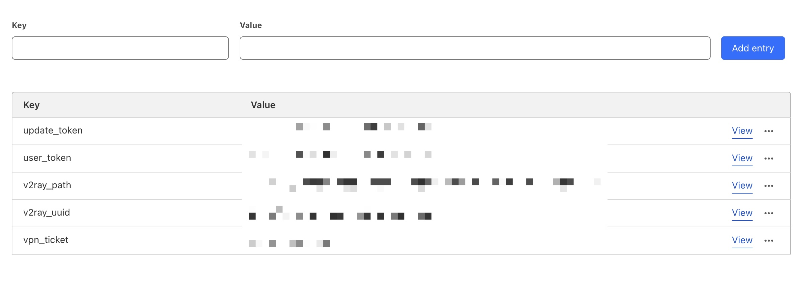

# webv2ray-worker

使用 WebVPN ticket 生成 V2Ray 配置 (Cloudflare Workers)

## 需求

- 一个在校内网运行的 V2Ray 服务端，可以使用 [v2ray-websocket](https://hub.docker.com/repository/docker/imbytecat/v2ray-websocket/general) 一键 Docker 部署，或手动部署
- 一个 Cloudflare 账号来运行此 Worker

## 开发与测试

使用 `wrangler` 创建 KV 存储，并配置文件中修改对应的 KV id：

```bash
# 创建一个开发环境 KV 存储
wrangler kv:namespace create WEBV2RAY --preview true
```

自定义 KV：

- `update_token`: 用于更新 WebVPN ticket
- `user_token`: 用于生成 V2Ray 配置
- `v2ray_uuid`: (需自建) 用于连接鉴权
- `v2ray_path`: (需自建) WebVPN 的 WebSocket 传输路径，类似 `/ws-80/77726476706e69737468656265737421fcff0f8f2f3d7c4530079bac/`

最后类似这样：



## 发布

使用 `wrangler` 创建 KV 存储，并配置文件中修改对应的 KV id：

```bash
# 创建一个正式环境 KV 存储
wrangler kv:namespace create WEBV2RAY --preview false
```

上传部署：

```bash
wrangler publish --env production
```
